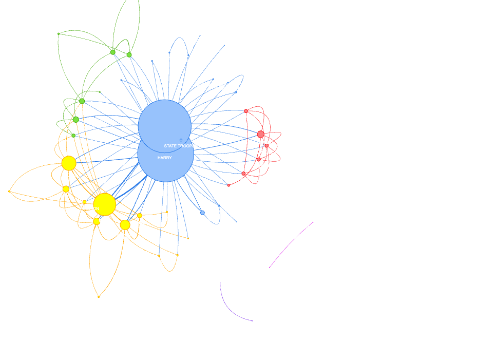
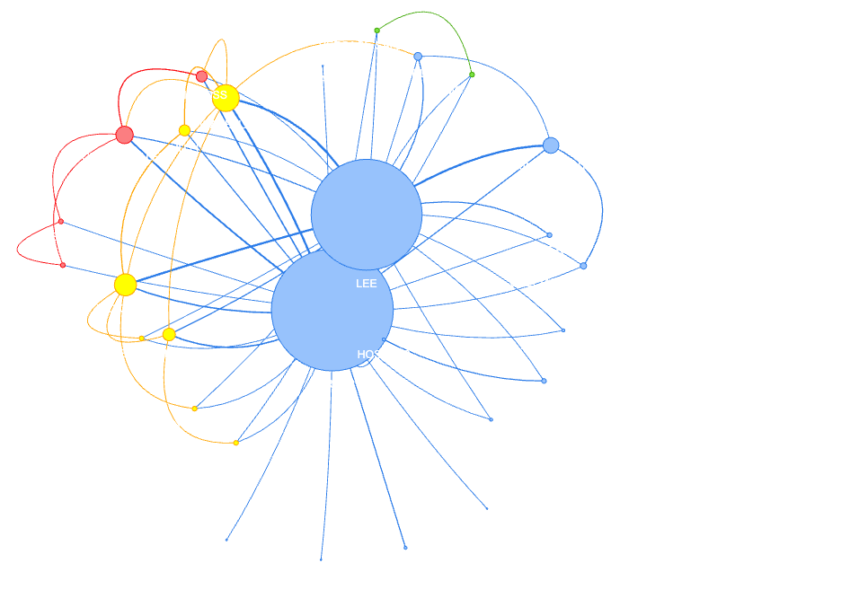

# Inside Screenplays
Visualize movie character structure from screenplay PDF and TXT files!

## Overview

This Streamlit-powered app allows you to view
the character network of feature-length screenplays.
You can either choose a movie from the database, or add
your own PDF or TXT file and save it.

The resulting graph (powered by ```pyvis```) displays the characters as nodes,
with weighted edges representing scene co-occurrence, as well as
character-level information about their role in the network.

The characters are also separated into communities and color-coded.

## Dependencies and Setup

### requirements

```commandline
pip install -r requirements.txt
```

### sense2vec
Download ```s2v_reddit_2015_md.tar.gz```:

```
https://github.com/explosion/sense2vec
```
Place in ```ScreenPy/sv2``` and open.

## Usage

```commandline
streamlit run inside_screenplays.py
```

After running the app, you have the option to either
browse the movies in the database, or upload your own
PDF or TXT file of a feature length screenplay.

Selecting an option from the "Movie Catalog" will access the movie's
information from the database (an H5Py file) and display the graph.


<table>
  <tr>
    <td>
      
      <br>
      <figcaption><em>Home screen</em></figcaption>
    </td>
    <td>
      
      <br>
      <figcaption><em>Graph for selected movie</em></figcaption>
    </td>
  </tr>
</table>

The graph also contains node-level information, such as degree, ranks in
Degree, Betweenness, and Closeness centrality and the sentiment
polarity of their dialogue in the screenplay.

All movies in the database are compared for structural similarity, and the most similar
movies are returned.

<figure style="display: inline-block; margin-right: 0px; text-align: left;">
  
  <figcaption><em>Information for HARRY in Dumb and Dumber</em></figcaption>
</figure><br/><br/>

<figure style="display: inline-block; margin-right: 0px; text-align: left;">
  
  <figcaption><em>Similar movies to Dumb and Dumber by <code>protagonist_edges</code> and <code>edges_among_leads</code> similarity functions.</em></figcaption>
</figure><br/><br/>

If you want to use your own PDF or TXT, drop it in and get a new graph. You can then save
it to add it to the database:

<figure style="display: inline-block; margin-right: 0px; text-align: left;">
  
  <figcaption><em>Save movie to database</em></figcaption>
</figure>

## Details

### App
The app was created in Streamlit. It connects to a text processing pipeline
that includes PDF to TXT (using ```pdftotext```), TXT to JSON (using [ScreenPy](https://github.com/drwiner/ScreenPy)),
```read_script.py``` which parses the JSON-structured screenplay information
for character lines and interaction, and ```build_graph.py``` which builds the
graph and manages the movies in the database (```movie_catalog.h5``` with ```h5Py```).

### Pipeline

When a new PDF file is added, ```pdf_to_txt.py``` uses the ```pdftotext``` package to read the PDF into a ```StringIO``` text buffer.
Then, that screenplay text is parsed into a JSON-structure using ```screenpile.py``` from the ScreenPy package, which identifies scenes,
segments, and segment types, including when a character is speaking.

This parsed screenplay information is passed into ```read_script.py```, which uses the scene and character dialogue information
to track scene co-occurences (if two characters speak in the same scene, the weight of the edge between them is incremented by 1).
The lines of each character are also put through NLTK's ```SentimentIntensityAnalyser``` to calculate their sentiment polarity.

The movie's character list, polarity scores, and scene co-occurrence adjacency matrix are returned, and passed through ```build_graph```,
which computes the network centralities for each character and includes this information in a corresponding ```pyvis``` graph.

Data for each movie is stored in an h5 file; when a user selects a movie from the database, the character list, polarities, and
adjacency matrix are retrieved to re-build the graph and display in the app.

### Graph Data

Part of the goal of this project is to highlight some insights into
the character structure of screenplays. In ```read_script.py```, each
character's lines are collected and run through NLTK's
```SentimentIntensityAnalyzer```, in order to assign a sentiment polarity
score for each character.

Also, we can use graph theory to calculate each node's importance in the
graph by calculating their Degree Centrality, Betweenness centrality
(importance to flow of the graph), and Closeness centrality
(strongly connected to other nodes).

Inside Screenplays also visualizes the community breakdown of the
character network using the ```community-louvain``` API by color-coding
the various communities in the network.

### Similarity Scores

There are several possible ways to measure similarity between two adjacency
matrices. Included in ```compare.py``` are Normalized Laplacian distance,
```edges_among_leads```: cosine distance between two vectors, each representing
a movie's weighted edges between its top k characters, and ```protagonist_edges```:
cosine distance where each vector represents a movie's main character's connections to
the top k other characters in the movie.

The latter two yield some promising results as a heuristic to identify movies
with similar structure. Take the movies <b>Dumber and Dumber</b> and <b>Rush Hour 2</b>,
which have a high similarity when using ```edges_among_leads```:

<figure style="display: inline-block; margin-right: 0px; text-align: left;">
  
</figure>

<figure style="display: inline-block; margin-right: 0px; text-align: left;">
  
  <figcaption><em>Comparison between <b>Dumber and Dumber</b> and
<b>Rush Hour 2</b>,
which have a low distance score of <code>0.0264</code>.</em></figcaption>
</figure>


