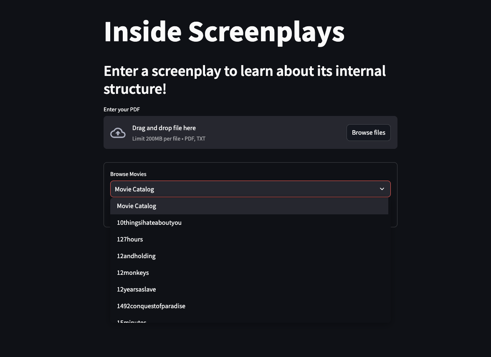

# Inside Screenplays
Visualize movie character structure from screenplay PDF and TXT files!

## Overview

This Streamlit-powered app allows you to view
the character network of feature-length screenplays.
You can either choose a movie from the database, or add
your own PDF or TXT file and save it.

The resulting graph (powered by ```pyvis```) displays the characters as nodes,
with weighted edges representing scene co-occurrence, as well as
character-level information about their role in the network.

The characters are also separated into communities and color-coded.

## Dependencies and Setup

### requirements

```commandline
pip install -r requirements.txt
```

### sense2vec
Download ```s2v_reddit_2015_md.tar.gz```:

```
https://github.com/explosion/sense2vec
```
Place in ```ScreenPy/sv2``` and open.

## Usage

```commandline
streamlit run inside_screenplays.py
```

After running the app, you have the option to either
browse the movies in the database, or upload your own
PDF or TXT file of a feature length screenplay.

Selecting an option from the "Movie Catalog" will access the movie's
information from the database (an H5Py file) and display the graph.


<figure style="display: inline-block; margin-right: 0px; text-align: left;">
  
  <figcaption>Home screen</figcaption>
</figure>

<figure style="display: inline-block; margin-right: 0px; text-align: left;">
  
  <figcaption>Graph for selected movie</figcaption>
</figure>

The graph also contains node-level information, such as ranks in
Degree, Betweenness, and Closeness centrality and the sentiment
polarity of their dialogue in the screenplay.

All movies in the database are compared for structural similarity, and the most similar
movies are returned.

<figure style="display: inline-block; margin-right: 0px; text-align: left;">
  
  <figcaption>Information for HARRY in Dumb and Dumber</figcaption>
</figure>

<figure style="display: inline-block; margin-right: 0px; text-align: left;">
  
  <figcaption>Similar movies to Dumb and Dumber by <code>protagonist_edges</code> and <code>edges_among_leads</code> similarity functions.</figcaption>
</figure>

If you want to use your own PDF or TXT, drop it in and get a new graph. You can then save
it to add it to the database:

<figure style="display: inline-block; margin-right: 0px; text-align: left;">
  
  <figcaption>Save movie to database</figcaption>
</figure>


## Details

## Examples


